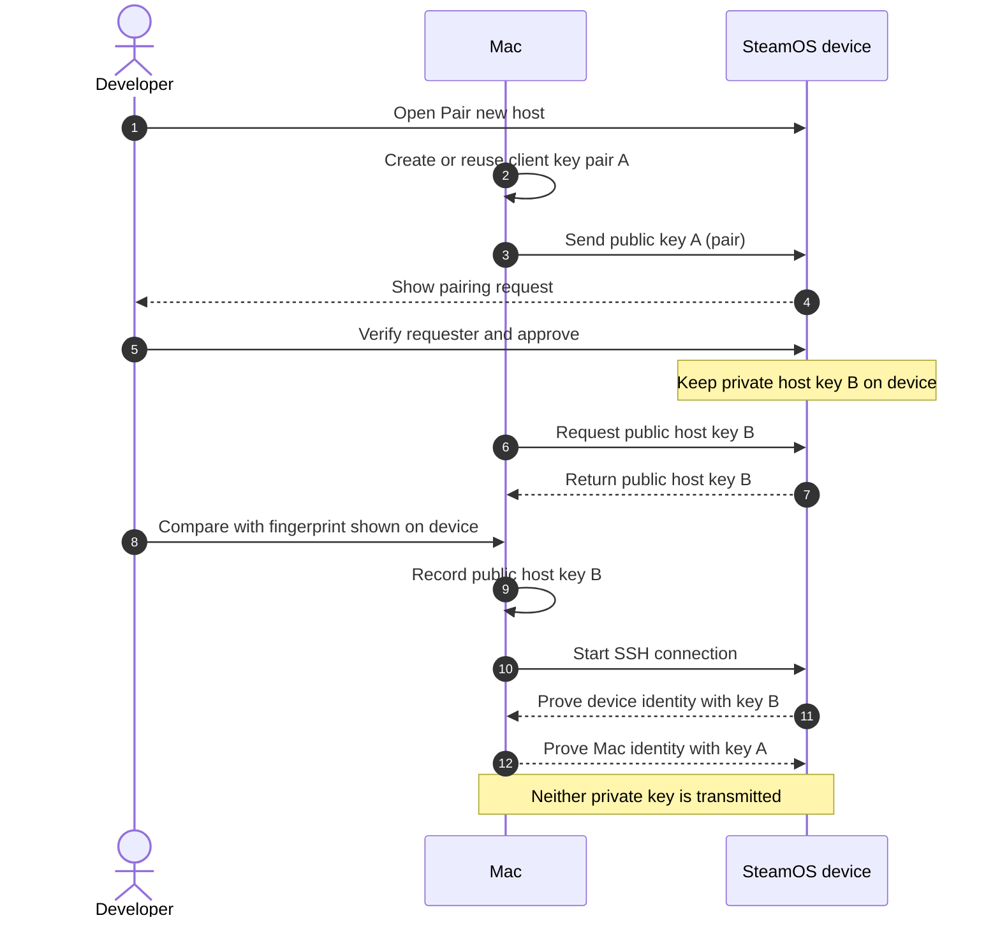

# Yuge Hasi Devkit

Yuge Hasi Devkit is a macOS command-line client for transferring a game
build to a paired SteamOS developer device and registering it with Steam. It
uses the device's SSH and Devkit facilities; it does not install a receiver,
server, or UI on the device.

## Supported environment

- Host: macOS 26 Tahoe or later on Apple Silicon.
- Device: a SteamOS device with Developer Mode and the Development Kit pairing
  flow available.
- Game build: an unpacked Linux x86_64 ELF64 build for Steam Deck or Steam
  Machine, or an Android ARM64 APK for Steam Frame (validated with PocketPop).

Steam Deck is validated with a Linux x86_64 PocketPop build, including transfer,
Steam registration, game display, input, exit, and launch after a Deck reboot.
Steam Frame pairing and status are validated; PocketPop APK transfer, Steam
registration, and game display were confirmed on device, including a Mac-side
capture. Input, exit, and launch after a headset reboot were also confirmed.
On Steam Machine, pairing, SSH authentication, Linux x86_64 build transfer,
Steam registration, and launch of PocketPop were confirmed, as were input,
exit, and launch after a Machine reboot.

Intel Macs and macOS releases earlier than 26 are outside the supported scope.
The CLI does not require the Steam client to be installed on the Mac.

## Requirements

- Rust 1.91.0 or later, including `rustfmt` and `clippy` for development.
- Standard macOS tools: `ssh`, `ssh-keygen`, `rsync`, `curl`, `unzip`, and a POSIX shell.
- A private LAN connection between the Mac and the SteamOS device.

## Installation

After the first release, install it with Homebrew:

```sh
brew install karad/yuge-hasi
```

Until then, build the executable from this repository:

```sh
cargo build --locked --release -p yuge-hasi-devkit
install -m 755 target/release/yuge-hasi /usr/local/bin/yuge-hasi
```

The release binary is `target/release/yuge-hasi`.

## Codex Plugin

Install the CLI first, then add the release marketplace and select **Install**
for **Yuge Hasi Devkit** in the Codex Plugins screen:

```sh
codex plugin marketplace add karad/yuge-hasi-dev --ref v0.1.0 --sparse .agents/plugins
```

The plugin guides pairing, validation, and deployment only when those actions
are requested. It does not include an MCP server or external service.

## How pairing and SSH keys work

There are two separate key pairs. The Mac keeps private key A and sends only
public key A to the SteamOS device for client authentication. The device keeps
private host key B; the Mac checks and records public host key B to verify the
device it is connecting to. Neither private key is sent to the other side.



The first `pair` request asks the device to register the Mac's public key but
does not verify SSH access. After approving it on the device, check its host-key
fingerprint locally before accepting the key on the Mac. On the tested Steam
Machine, the host public key appeared only after the initial pairing; the
precise time at which SteamOS generated it was not established.

The Mac's client key pair and trusted device host keys are shared by all game
projects in `~/.yuge-hasi/devkit-client-rust/`. Registered device names and
connection details are shared in `~/.yuge-hasi/devices.toml`. Each game's
`yuge-hasi-devkit.toml` contains only its own build and launch settings.

## Quick start

1. On the SteamOS device, enable Developer Mode and open **Settings → Developer
   → Development Kit → Pair new host**.
2. Send the pairing request from the Mac, then verify and approve it on the
   device screen. `pairing_request_completed: true` does not mean SSH has been
   verified:

```sh
yuge-hasi devkit pair --host 192.168.1.42
```

3. After approval, use Desktop Mode on the device to find your login name and
   its SSH host-key fingerprint. Keep the fingerprint available for comparison;
   do not trust a value supplied only by a network scan:

```sh
whoami
ssh-keygen -lf /etc/ssh/ssh_host_ed25519_key.pub -E sha256
```

4. Build a project configuration:

```sh
yuge-hasi devkit project init \
  --title MyGame \
  --source /path/to/build \
  --executable MyGame.x86_64
```

5. Add the paired device. Compare the full fingerprint displayed on the Mac
   with the value shown on the device, then enter the device's value. If SSH
   authentication is rejected, follow the terminal prompts to pair again:

```sh
yuge-hasi devkit device add deck --host 192.168.1.42 --login deck
```

List the registered device names before selecting one to remove:

```sh
yuge-hasi devkit device list
```

Remove a device from this Mac's shared registry using the listed name:

```sh
yuge-hasi devkit device remove deck
```

Removing a device clears only its local registration. It does not revoke this
Mac's SSH authorization on the SteamOS device.

6. Confirm its readiness without uploading or registering the game:

```sh
yuge-hasi devkit status --host 192.168.1.42 --login deck
yuge-hasi devkit deploy --device deck --check
```

7. Stop the game on the SteamOS device, then deploy and register the build:

```sh
yuge-hasi devkit deploy --device deck --game-stopped
```

Use `yuge-hasi devkit --help` for the complete command reference.

For a Steam Frame APK, use a separate project file so the Deck build settings
are preserved. The APK filename is inferred; Android launch arguments are not
supported by this workflow:

```sh
yuge-hasi devkit --project /path/to/frame-project.toml project init \
  --title MyGame \
  --source /path/to/MyGame.apk \
  --runtime android
yuge-hasi devkit --project /path/to/frame-project.toml device add frame \
  --host DEVICE_LAN_IP --login DEVICE_LOGIN
yuge-hasi devkit --project /path/to/frame-project.toml deploy --device frame --check
```

After verifying the selected project and device and stopping the game, run
`deploy --device frame --game-stopped` with the same `--project` option. The
check does not upload anything. Device launch still needs manual verification.

If an existing project file uses `schema_version = 1`, migrate it before using
the shared settings:

```sh
yuge-hasi devkit --project /path/to/yuge-hasi-devkit.toml project migrate
```

Migration copies the existing client key pair and trusted host keys into the
shared directory, imports its device names, and updates the project file to
schema version 2. It leaves the old credentials in place as a backup. Run the
command for each old project file. A conflicting device name, host key, or
client identity stops migration without replacing the shared identity; resolve
the conflict explicitly before retrying. New projects use shared settings from
the start. `--config` remains an explicit override only for standalone
`init`, `pair`, `trust-host`, `status`, and `upload` commands.

## Security notes

- Verify the SSH host-key fingerprint against the value shown on the SteamOS
  device before trusting it. The CLI rejects untrusted and changed host keys.
- Pairing approval happens on the SteamOS device. Never treat a network response
  as a substitute for the on-device confirmation.
- Keep `~/.yuge-hasi/` private. It contains device connection details and SSH
  credentials. The CLI creates it with owner-only permissions.
- Deployment changes game files and Steam registration on the selected device.
  Verify the target device and stop the game before using `deploy`.

## Limitations

- Linux x86_64 and Android ARM64 APK workflows are implemented. Steam Frame
  support for the initial release is limited to Android ARM64 APKs. Linux ARM64
  and Windows/Proton builds are outside the initial scope and are not supported.
- Steam Frame APK transfer, Steam registration, and game display have been
  validated with PocketPop, along with input, exit, and launch after a headset
  reboot. Other Android titles have not been validated.
- The tool does not detect whether a game is running; `--game-stopped` records
  your confirmation.
- It does not remove files omitted from a later build, provide rollback, or
  coordinate concurrent updates from multiple Macs.

## License

This project is licensed under the [MIT License](LICENSE). See [NOTICE](NOTICE)
and [the Valve protocol notice](crates/devkit/VALVE-NOTICE) for third-party
attribution.

## Trademark and affiliation notice

Steam, SteamOS, Steam Deck, and Valve are trademarks or registered trademarks
of Valve Corporation. Yuge Hasi Devkit is an independent project and is not
affiliated with or endorsed by Valve Corporation.
